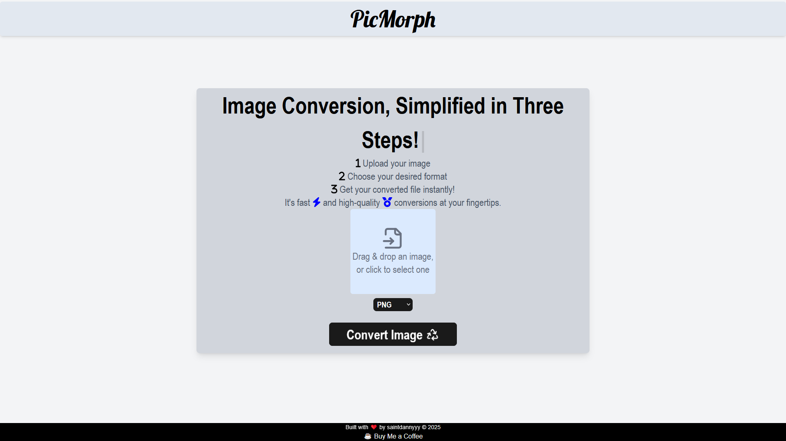

# PicMorph [🔗](https://picmorph-five.vercel.app/)

PicMorph is a web application that enables users to upload images and convert them into various formats. It features a React-based frontend and an Express.js backend powered by Sharp for fast and efficient image processing.

## Features

- Upload and convert images to various formats (JPEG, PNG, WebP, GIF, TIFF, AVIF).
- Fast and efficient image processing with Sharp.
- Clean and modern UI built with Tailwind CSS.
- Provide a download link for the converted image

## Tech Stack

### Frontend

- React (Vite)
- Axios (for API requests)
- TailwindCSS (for styling)

### Backend

- Node.js, Express.js
- Multer (for handling file uploads)
- Sharp (for image conversion)
- CORS (for cross-origin requests)

## Usage

1. [Open PicMorph in your browser](https://picmorph-five.vercel.app/).
2. Upload an image file.
3. Select the desired format.
4. Click **Convert**.
5. Download the converted image once it's ready.

## Contributing

We welcome contributions from developers! Follow these steps to contribute:

1. Fork the repository.
2. Create a new branch (`git checkout -b feature-name`).
3. Make your changes and commit (`git commit -m "Added new feature"`).
4. Push to your fork (`git push origin feature-name`).
5. Open a Pull Request.

Make sure your code follows best practices and is well-documented.

## License

This project is open-source and available under the MIT License.

## Contact

For questions or suggestions, feel free to [send an email](mailto:danieltesla746@gmail.com) or open an issue on the repository.

---
